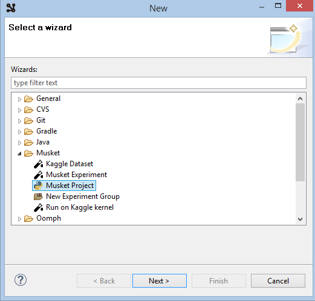
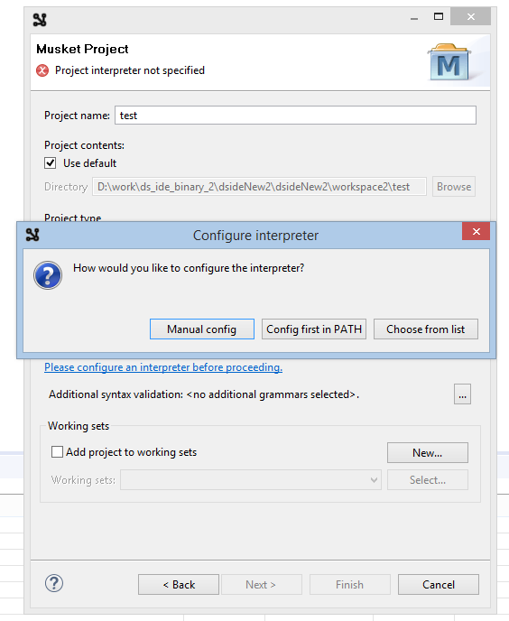
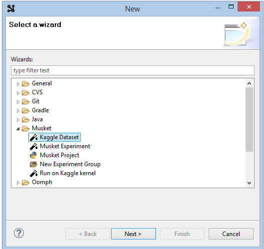
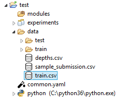
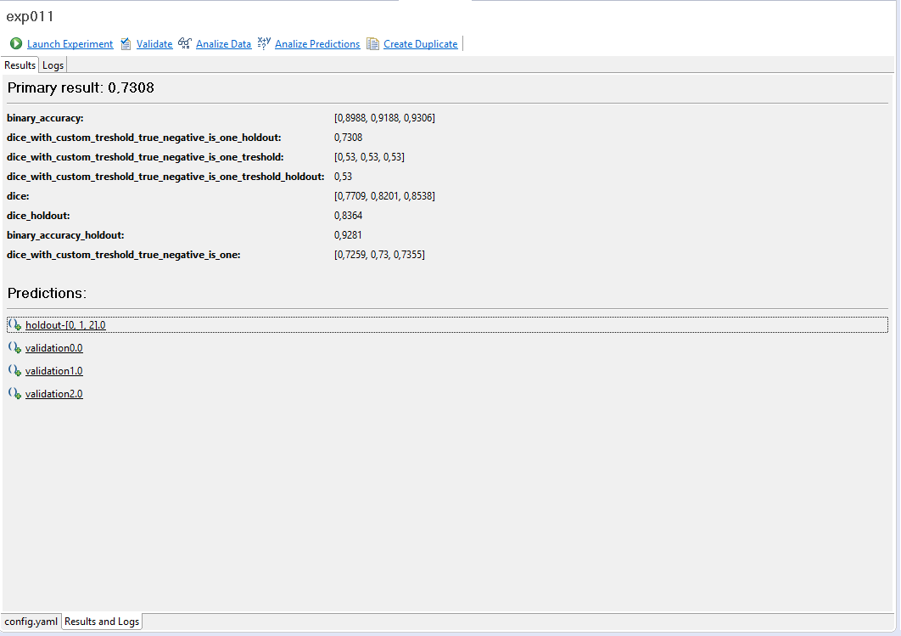

# Setup
### Download
[Download Musket IDE for Windows](http://onpositive.club/public/dsideNew2.zip) 

[Download Musket IDE for MacOS](http://onpositive.club/public/dside.zip)
### Installation

* Install [Musket Core](../generic/index.md). Read installation instructions [here](../generic/index.md#installation).
* Install [Segmentation Pipeline](../segmentation/index.md). Read installation instructions [here](../segmentation/index.md#installation).
* Install [Classification Pipeline](../classification/index.md). Read installation instructions [here](../classification/index.md#installation).

Unzip and launch executable (`ds-ide.exe` for Windows and `ds-ide` for MacOS).

### Setting up a project

Launch `File->New...` from the main menu.

Choose `Musket->Musket Project` in the `New` dialog.

Click `Next`, enter new project name and click `Please configure an interpreter...` to set up python interpreter.

Try `Config first in PATH` option first, if it fail o auto-detect you python, use other options.

Click `Finish` and accept opening the new perspective.

This will create the project structure for you, details regarding the structure can be found [here](../generic/index.md#project-structure).

### Getting dataset from Kaggle

#### Installing kaggle stuff 
This should be done only once, first time you are getting something from Kaggle.

Run `pip install kaggle` in console.

Log into [Kaggle](https://www.kaggle.com)
Click on a profile in the top-right corner and choose `My Account`

On the account page find `Api` section and click `Create New API Token`. 
This will launch the download of `kaggle.json` token file.
Put the file into `~/.kaggle/kaggle.json` or `C:\Users\<Windows-username>\.kaggle\kaggle.json` depending on OS.

Note: there are potential troubles of creating `C:\Users\<Windows-username>\.kaggle` using windows explorer. 
To create this folder from console, run `cmd` and launch the following commands:
`cd C:\Users\<Windows-username>`, `mkdir .kaggle`.

Consult to [Kaggle API](https://github.com/Kaggle/kaggle-api) in case of other troubles.

#### Downloading the dataset

Back to IDE. Select your new project root in project explorer, right-click and select `New->Other`...

Choose `Musket->Kaggle Dataset`.

Click `Next` and select `competition`, enter `salt` into a search box and click `Search`.

Select `tgs-salt-identification-chellenge` and click `Finish`.

This will start dataset download, check its progress in console.

### Creating an experiment

In project explorer, double-click on the newly downloaded `train.csv`

There is lots of stuff here, but we want to make an experiment from the dataset for now.

Click the `Generate` button in the toolbar in the top-right corner of the viewer.

Choose a name like `train_ds` and `Generate Musket Wrappers`, click `Ok`.

Accept to configure an experiment, enter any name like `exp01` and click `Finish`.

You now have `exp01` folder inside `experiments` folder and `config.yaml` file there.

`datasets.py` is also generated inside `modules` folder.

### Running an experiment

Open experiment file with double-click in project explorer ...

... and click on `Launch experiment` in the tool bar of the editor.

This should launch an experiment, you can track what's going on in the console.

When the experiment is finished, overal statistics should appear in the `Results and logs` tab:

It must also generate `summary.yaml` file in the experiment folder and `metrics*.csv` files in `metrics` subfolder.

Check these files, they contain lots of useful statistics.

### What is next

Check the videos to find out what you can do with experiment results: [tutorials](https://www.youtube.com/playlist?list=PLyV40LHl22j5VOv2DgHoNDkpxkfueIQmn).

Later on we will add main points here. 